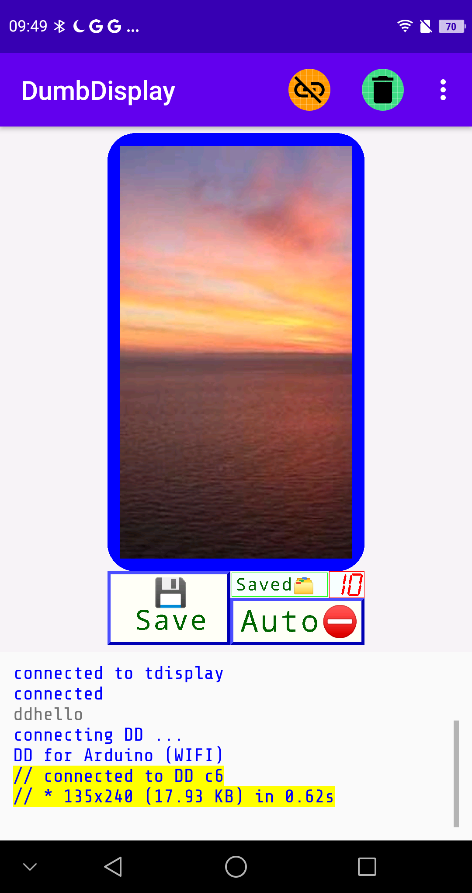
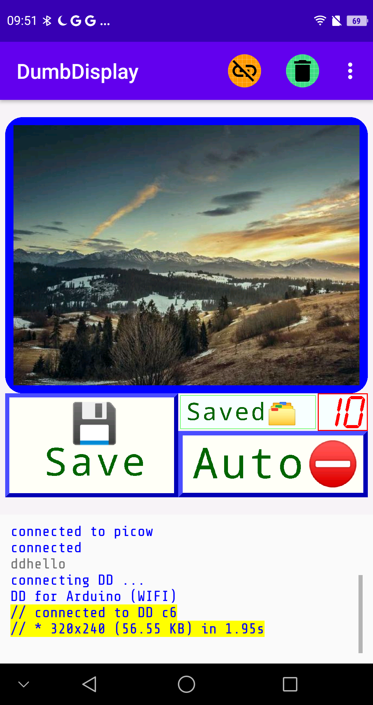
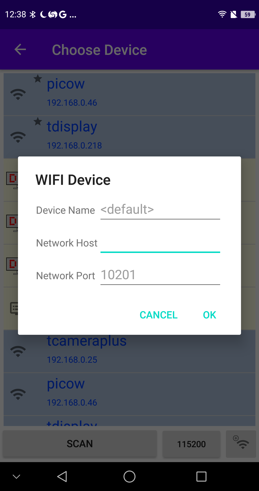

# Simple Arduino Framework Raspberry Pi Pico / ESP32 TFT LCD Photo Frame Implementation with Photos Downloaded from the Internet via DumbDisplay

The target of this [project](https://github.com/trevorwslee/TFTImageShow) is to implement a simple Arduino framework photos / images showing "photo frame" using Raspberry Pi Pico or ESP32 with photos / images downloaded from the Internet via DumbDisplay -- an Android app running on your Android phone.

The microcontroller program here is developed in Arduino framework using VS Code and PlatformIO, in the similar fashion as described the post -- [A Way to Run Arduino Sketch With VSCode PlatformIO Directly](https://www.instructables.com/A-Way-to-Run-Arduino-Sketch-With-VSCode-PlatformIO/)

The simple remote UI for downloading photos / images from the Internet is realized with the help of the DumbDisplay Android app. For a brief desciption of DumbDisplay, you may want to refer to the post -- [Blink Test With Virtual Display, DumbDisplay](https://www.instructables.com/Blink-Test-With-Virtual-Display-DumbDisplay/)

Please note that
* The UI is driven by the microcontroller program (sketch).
* The downloaded image -- be it in **Jpeg** or **PNG** format -- will be transferred to the microcontroller board in **Jpeg** format, scaled to site inside the TFT LCD screen.

For Raspberry Pi PicoW board (WiFi), a ST7789 2.8 inch 240x320 SPI TFT LCD screen is attached to a Raspberry Pi PicoW board.
The TFT LCD module library used is the `Adafruit-ST7735-Library` Arduino library.

For ESP32, LiLyGo TDisplay / TCamera Plus board is used. 
The TFT LCD module library use is the `bodmer/TFT_eSPI` Arduino library.

In all cases, the **Jpeg** library used is the `bodmer/TJpg_Decoder` Arduino library.

A simple flash-based **LittleFS** file-system is allocated for storing the downloaded and transferred **Jpeg** images.

The microcontroller board has two running modes:

1) When connected to the DumbDisplay Android app (using WiFi), a simple UI is provided for downloading images from some predefined sites,
   as well as for transferring the downloaded image in **Jpeg** format to the microcontroller board.
   Note that the predefined sites is hardcoded in the sketch that you can conveniently change as desired by changing the sketch.
2) When not connected to the DumbDisplay Android app, the microcontroller cycles through the saved **Jpeg** images and display them to the TFT LCD 
   screen one by one, like a simple "photo frame". Note that since the images are stored in **LittleFS**, they will survive even after reboot of the
   microcontroller board.

***Connect for the UI; disconnect to enjoy "photo frame" slide show.***    

# The UI

|  |  |
|--|--|
|||

The first time connected, an image download will be initiated automatically. After downloading an image the image will be transferred to the microcontroller board in **Jpeg** format and be displayed to the TFT LCD screen.

You can choose to save the transferred image by clicking the ***💾Save*** button.
Notice that the [7-segment] *number* displayed next to the ***Saved🗂️*** label will be bumped up. The *number* indicates the number of images saved to the microcontroller's **LittleFS** storage.

If you so desired, you can turn on auto-save by clicking the ***Auto*** save button. (You turn off auto-save by clicking the button again.)

If you want to trigger another download of image, click on the canvas that shows the downloaded image.

If you want to delete all the saved images, double-click on the [7-segment] *number*.

After you are done with downloading and saving images, disconnect the microcontroller. After disconnection, the "photo frame" slide show begins in the microcontroller side.

Anytime you want to change the saved images, reconnect to DumbDisplay Android app.

***Connect for the UI; disconnect to enjoy "photo frame" slide show.***    

# Wiring TFT LCD Module

For LiLyGo TDisplay / TCamera Plus board, the TFT LCD screen is pre-build in the microcontroller board; hence, no need for any wiring.

For Raspberry Pi Pico board, as mentioned previously, a ST7789 2.8 inch 240x320 SPI TFT LCD module is used; hence, some wiring is necessary

|Raspberry Pi Pico|SPI TFT LCD |
|-----------------|------------|
| 3V3             | VCC        |
| GND             | GND        |
| GP21            | BL         |
| GP17            | CS         |
| GP16            | RS / DC    |
| GP18            | CLK / SCLK |
| GP19            | SDA / MOSI |
| GP20            | RST        |


# Developing and Building of the Sketch

As mentioned previously, the sketch will be developed using VS Code and PlatformIO. Please clone the PlatformIO project [TFTImageShow](https://github.com/trevorwslee/TFTImageShow) GitHub repository.

The configurations for developing and building of the sketch in basically captured in the `platformio.ini` file
```
[env]
monitor_speed = 115200

[env:PICOW]  ; ensure long file name support ... git config --system core.longpaths true
platform = https://github.com/maxgerhardt/platform-raspberrypi.git
board = rpipicow
framework = arduino
board_build.core = earlephilhower
board_build.filesystem = littlefs
board_build.filesystem_size = 1m
lib_deps =
    https://github.com/trevorwslee/Arduino-DumbDisplay
    https://github.com/adafruit/Adafruit-ST7735-Library.git
    https://github.com/adafruit/Adafruit-GFX-Library
    https://github.com/Bodmer/TJpg_Decoder.git 
    Wire
    SPI
    https://github.com/adafruit/Adafruit_BusIO 
build_flags =
    -D FOR_PICOW

[env:TDISPLAY]
platform = espressif32
board = esp32dev
framework = arduino
board_build.filesystem = littlefs
lib_deps =
    https://github.com/trevorwslee/Arduino-DumbDisplay
    bodmer/TFT_eSPI     ; Setup25_TTGO_T_Display
    bodmer/TJpg_Decoder
    LittleFS
build_flags =
    -D FOR_TDISPLAY

[env:TCAMERAPLUS]
platform = espressif32
board = esp32dev
framework = arduino
board_build.filesystem = littlefs
lib_deps =
    https://github.com/trevorwslee/Arduino-DumbDisplay
    bodmer/TFT_eSPI      ; modify User_Setup_Select.h ... Setup44_TTGO_CameraPlus
    bodmer/TJpg_Decoder
    LittleFS
    Wire
    SPI
    SPIFFS
build_flags =
    -D FOR_TCAMERAPLUS
```

***Please make sure you select the correct PlatformIO project environment*** -- `PICOW` / `TDISPLAY` / `TCAMERAPLUS`

For `PICOW`, the platform core is download from `https://github.com/maxgerhardt/platform-raspberrypi.git`.
(As far as I know, this is the only PlatformIO platform core that supports the use of Raspberry Pi PicoW WiFi capability.)

It might take a long time for PlatformIO to download it. If PlatformIO fails to install the platform core, it might be that your system doesn't have long "file name" enabled, in such a case, try 
```
git config --system core.longpaths true
```  

For `TDISPLAY` that uses `bodmer/TFT_eSPI`, you will need to modify the installed `.pio/libdeps/TDISPLAY/TFT_eSPI/User_Set_Select.h`
to use `User_Setups/Setup25_TTGO_T_Display.h` rather than the default `User_Setup.h` like
```
...
//#include <User_Setup.h>           // Default setup is root library folder
...
#include <User_Setups/Setup25_TTGO_T_Display.h>    // Setup file for ESP32 and TTGO T-Display ST7789V SPI bus TFT
...

```  

For `TCAMERAPLUS` which also uses `bodmer/TFT_eSPI`, modify `User_Set_Select.h` similarly
```
...
//#include <User_Setup.h>           // Default setup is root library folder
...
#include <User_Setups/Setup44_TTGO_CameraPlus.h>   // Setup file for ESP32 and TTGO T-CameraPlus ST7789 SPI bus TFT    240x240
...

```  

The program entry point is `src/main.cpp`

```
// ***
// the below _secret.h just define macros like:
// #define WIFI_SSID           "your-wifi-ssid"
// #define WIFI_PASSWORD       "your-wifi-password"
// ***
#include "_secret.h"

#include "tft_image_show/tft_image_show.ino"
```

Notice there are two **included** files -- `_secret.h` and `tft_image_show/tft_image_show.ino` -- in the `src` directory

You will need to create the `_secret.h` with content like
```
#define WIFI_SSID           "your-wifi-ssid"
#define WIFI_PASSWORD       "your-wifi-password"
```

With proper WiFi setup, the microcontroller board will connect to DumbDisplay Android app using WiFi.

If you do not want to use WiFi, simply don't provide the macros `WIFI_SSID` and `WIFI_PASSWORD`.
In such a case, connection to DumbDisplay Android app is assumed to be via OTG. Please refer to the above mentioned post -- [Blink Test With Virtual Display, DumbDisplay](https://www.instructables.com/Blink-Test-With-Virtual-Display-DumbDisplay/)

The sketch of the project is `tft_image_show/tft_image_show.ino`. You can customize some aspects of the sketch

```
...
// NEXT_S defines the delay (in seconds) to show next saved image
#define NEXT_S              5
...
// MAX_IMAGE_COUNT define that maximum number of images that can be saved
// set MAX_IMAGE_COUNT to 0 to force reformat the storage
#define MAX_IMAGE_COUNT     10
...
// getDownloadImageURL() returns a URL to download an image; add / remove sites as needed
// download image bigger than needed (on purpose)
const String urls[] = {
  String("https://loremflickr.com/") + String(2 * TFT_WIDTH) + String("/") + String(2 * TFT_HEIGHT),
  String("https://picsum.photos/") + String(2 * TFT_WIDTH) + String("/") + String(2 * TFT_HEIGHT),
};
const char* getDownloadImageURL() {
  int idx = random(2);
  return urls[idx].c_str();
}
...
```
* The slide show delay is defined by the macro `NEXT_S`, which default to 5 seconds
* The maximum number of saved images is defined by the macro `MAX_IMAGE_COUNT`, which default to 10.
  Note that if you set `MAX_IMAGE_COUNT`, flash and run the sketch, the **LittleFS** storage will be reformatted.
  For normal running, `MAX_IMAGE_COUNT` should be at lease 1.
* You can modify `urls` / `getDownloadImageURL()` to add / remove Internet sites for downloading images.  


Build, upload the sketch and try it out! 

For WiFi connectivity, you will need to find out the IP address of the microcontroller board. Simply connect the microcontroller board with a Serial monitor (set to use baud rate 115200), you should see lines like
```
binded WIFI TrevorWireless
listening on 192.168.0.218:10201 ...
listening on 192.168.0.218:10201 ...
```

|||
|--|--|
|See that the IP address of the microcontroller board is printed out. You will need this IP address to configure DumbDisplay Android app to connect it with your microcontroller||

* Start the DumbDisplay app.
* Click on the Establish Connection icon.
* In the "establish connection" dialog, you should see the "add WIFI device" icon at the bottom right of the dialog. Click on it.
* A popup for you to enter WIFI IP will be shown. Enter the IP address of your ESP board as Network Host. Click OK when done.
* Back to the "establish connection" dialog, a new entry will be added, click on it to establish WIFI connection.


Have fun with it!


# Enjoy!

> Peace be with you!
> May God bless you!
> Jesus loves you!
> Amazing Grace!


